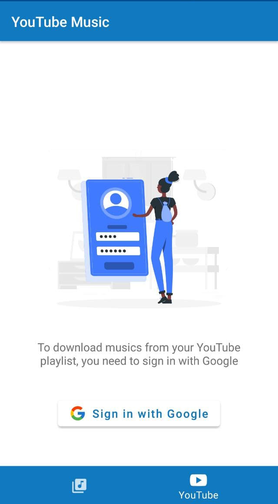
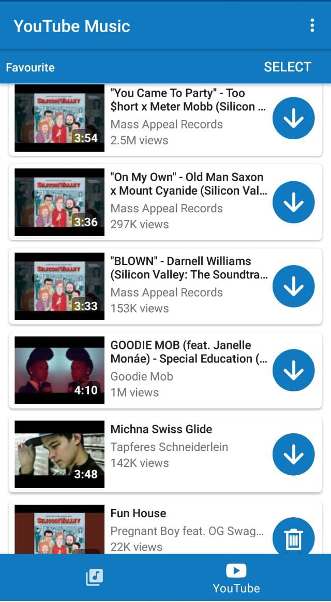
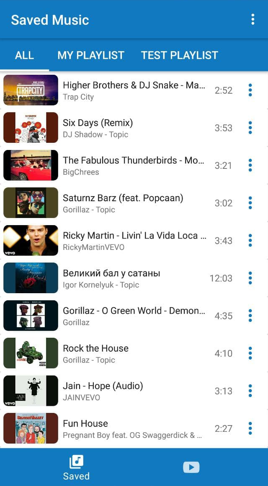
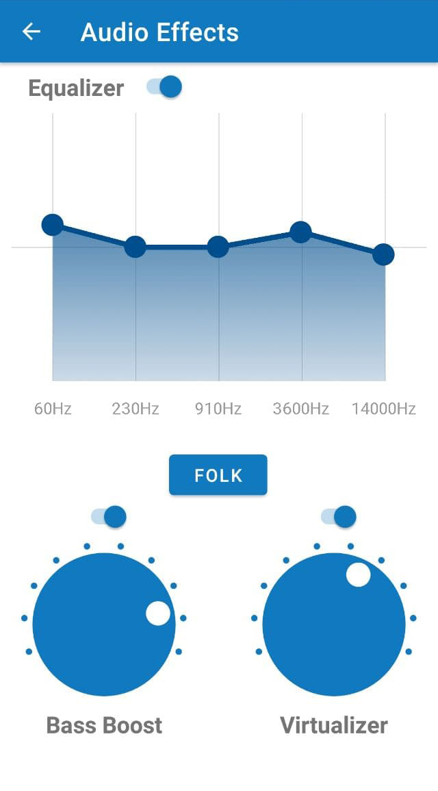
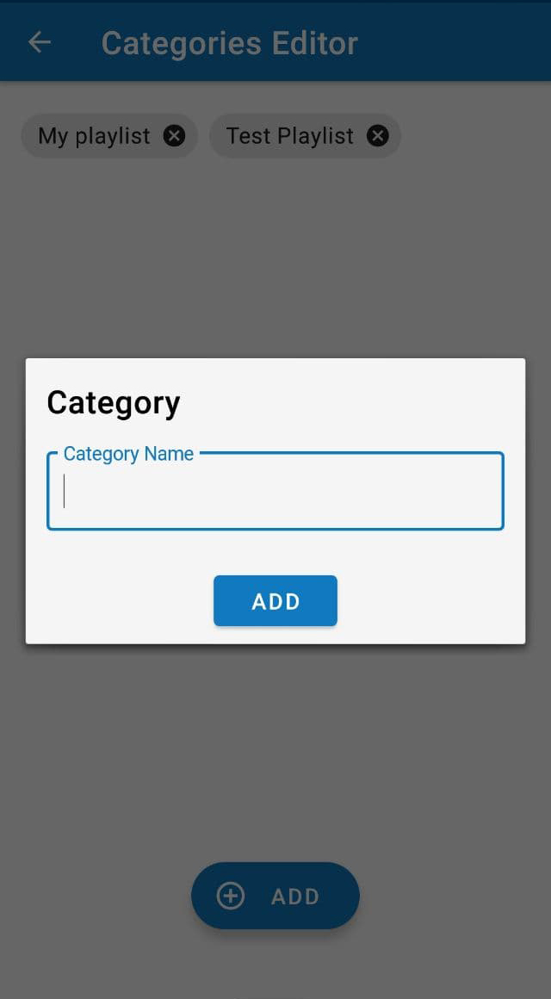
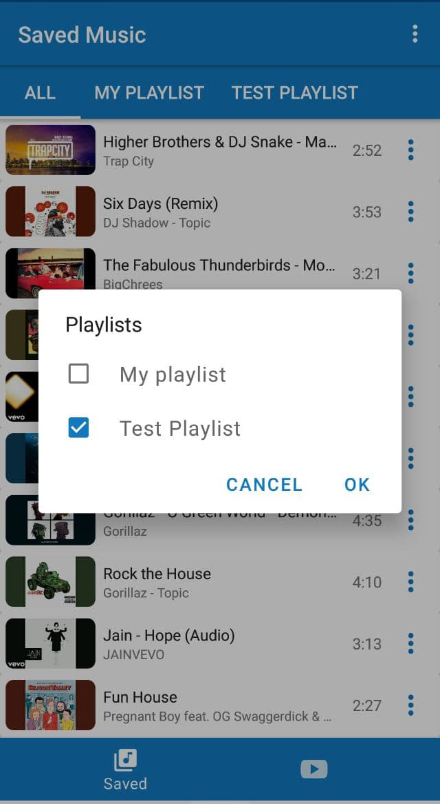
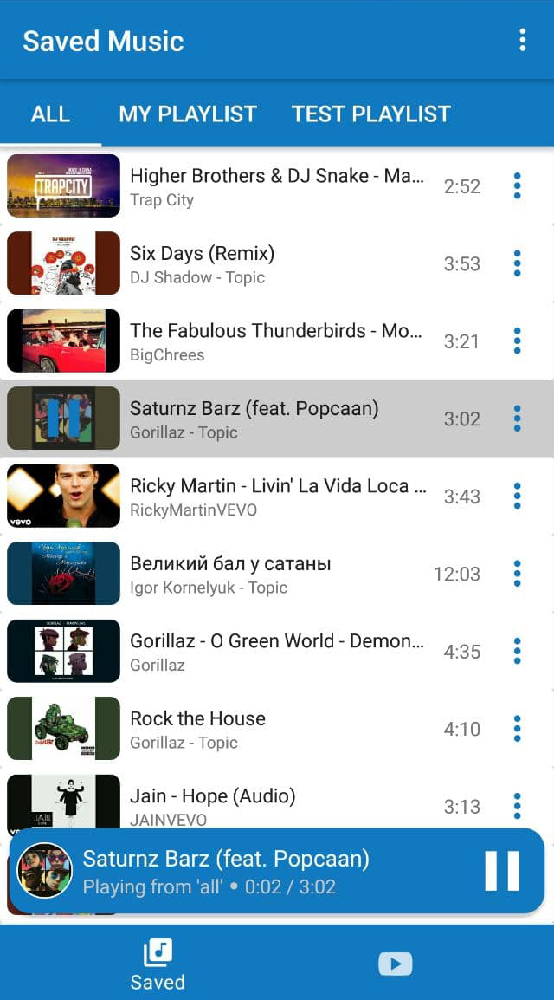
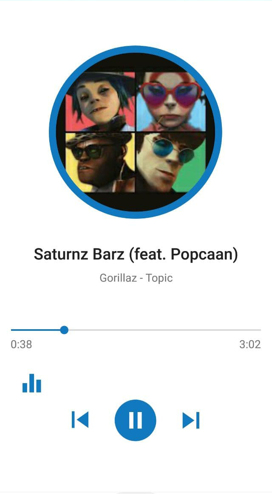

# YouTube Music
Quite simple Android application to download and playing music from YouTube. 
The application consists of two main parts: the first part is Saved Music and the second part is YouTube Music where you can download music from YouTube, but first of all, you need to log in.

&nbsp;
&nbsp;
&nbsp;

The app also contains an equalizer

&nbsp;

You can create your own playlists and append downloaded musics

&nbsp;
&nbsp;

Once you've downloaded the music, you can listen to it

&nbsp;
&nbsp;

Media Service is implemented along with the media-compat library. So the app is integrated with smartwatches and cars.

--------------------------------------------------------------------------------------------------------------

**Downloading musics from YouTube is **not stable**, because Youtube often changes web structure of its pages.**

**WARNING**: Youtube API does not support a video download. In fact, it is prohibited - [Terms of Service - II. Prohibitions](https://developers.google.com/youtube/terms/api-services-terms-of-service). 
 **WARNING**: Downloading videos may violate copyrights! 
  This application is only for educational purposes. I urge not to use this project to violate any laws.
